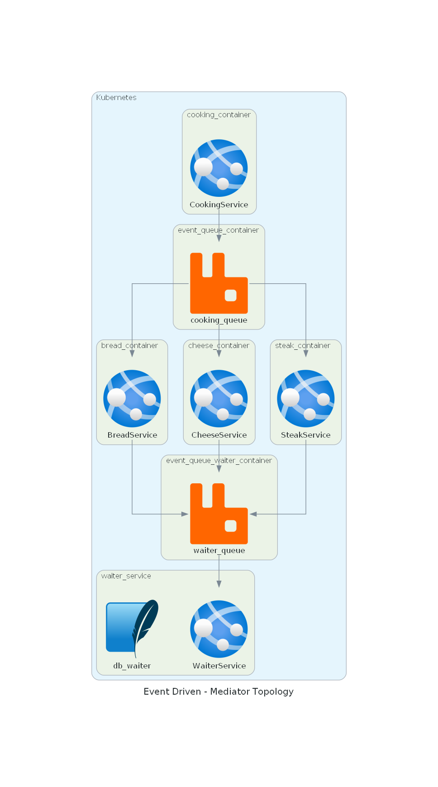

# Event Driven - Mediator Topology

Demonstration in a simple way in how to use the event driven architecture using the mediator topology.

## :eyes: What's next
- Implementing the steak service
- Reorganizing the services files

## :triangular_ruler: Big Picture 

